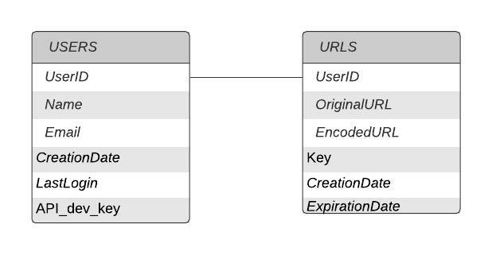

Database Schema


# Database Schema Design Doc

### Requirements

#### Functional


- Have Users details in one Table
- Have URL details in one Table
- Each User can have multiple URLs


#### Non-Functional


- Discourage usage on joins, as Tables are read heavy.
- High Consistency

### Technical Plan





- UserID will have 1:N relationship between Users Table and URLs Table
- UserID auto-increment
- Date Field auto generate using datetime object
- api-dev-key also auto-generate using default lambda function
- Users Table can have different user details
- API dev key will generated using uuid which will help in creating keys ,unique api_dev_key constraint set by db


##### User Query After login:

```
Select UserID, Name, Email from Users where UserID = 1234
```

##### URL Redirection Query:

```
Select OriginalURL from URLS where UserID = ”1234” and ExpirationDate < GetDate() and EncodedURL = ‘short_url_clicked”
```


